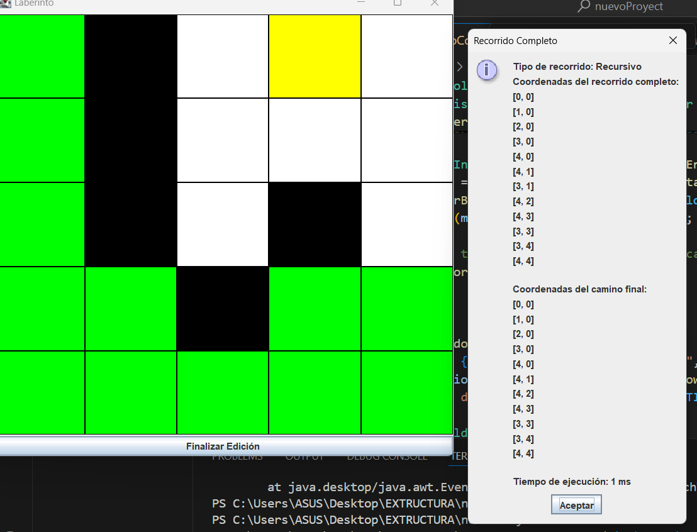

## Informe del Proyecto

## Extructura de Datos

## Nombre de los Integrantes:
[Plasencia Cuzco Luis Alberto] - [lplasenciac@est.ups.edu.ec]

## Descripción del Problema
Este proyecto consiste en una aplicación de laberinto desarrollada en Java utilizando Swing, que permite a los usuarios definir paredes, puntos de inicio y fin en una cuadrícula de laberinto. Además, se implementan algoritmos de búsqueda para encontrar el camino más corto en el laberinto, incluyendo métodos recursivos, BFS (Breadth-First Search) y DFS (Depth-First Search).

## Herramientas y Lenguajes Utilizados
- Lenguaje de Programación: - Java
- Biblioteca de Interfaz Gráfica: Swing (para la creación de la interfaz gráfica de usuario)
- Algoritmos Implementados:
    Método Recursivo Simple: Para encontrar caminos de forma exhaustiva.
    - Método con Cache (Programación Dinámica): Para almacenar y reutilizar resultados intermedios y mejorar la eficiencia.
    - BFS (Breadth-First Search): Para encontrar el camino más corto en un grafo.
    - DFS (Depth-First Search): Para explorar todas las posibles rutas en el laberinto.
- Entorno de Desarrollo: IntelliJ IDEA / Eclipse
Sistema de Control de Versiones: Git (para gestión de código y colaboración)

## Criterios por Integrante:
[Luis Plasencia]:

- Contribuciones: Desarrolle una simulacion de un laberinto con interfaz grafica  para poder elegir diferentes metodos que vimos en clases.
- Responsabilidad: Implementacion de codigo que hemos visto en las clases y otros temas investigados para poder crear la interfaz grafica y asi lograr el proposito de nuestra aplicacion en java utilizando los diferentes recorriodos utilizando pilas y colas en diferentes metodos.

- Método Recursivo Simple:

  - Ventajas: Fácil de entender e implementar. Adecuado para laberintos pequeños o menos complejos.
  - Desventajas: No es eficiente para laberintos grandes o complejos debido a la alta complejidad temporal y la posibilidad de causar desbordamiento de pila (stack overflow). La búsqueda puede volverse muy lenta y consumir mucha memoria.
  - Conclusión: Este método es útil principalmente para fines educativos o en situaciones donde el tamaño del laberinto es pequeño. No es adecuado para aplicaciones prácticas en laberintos grandes debido a su ineficiencia.

- Programación Dinámica con Cache:

  - Ventajas: Mejora significativamente la eficiencia al evitar la recalculación de resultados ya conocidos. Reduce el tiempo de ejecución al almacenar y reutilizar resultados intermedios.
  - Desventajas: Requiere más memoria para almacenar el cache, y la implementación puede ser más compleja.
  - Conclusión: La programación dinámica con cache es una solución eficiente para encontrar el camino en laberintos grandes. Ofrece un buen equilibrio entre tiempo de ejecución y uso de memoria, haciendo que sea una opción viable para aplicaciones prácticas.

- BFS (Breadth-First Search):

  - Ventajas: Garantiza encontrar el camino más corto en un grafo no ponderado. Es más eficiente en términos de tiempo para laberintos grandes en comparación con métodos recursivos simples.
  - Desventajas: Requiere una cantidad significativa de memoria, especialmente para laberintos grandes, debido al almacenamiento de todos los nodos en el nivel actual.
  - Conclusión: BFS es muy adecuado para encontrar el camino más corto en laberintos y grafos no ponderados. Es más eficiente que el método recursivo simple y proporciona resultados óptimos, aunque puede consumir mucha memoria.

- DFS (Depth-First Search):

  - Ventajas: Generalmente utiliza menos memoria que BFS, ya que no necesita almacenar todos los nodos en el nivel actual.
  - Desventajas: No garantiza encontrar el camino más corto y puede ser menos eficiente en encontrar una solución en laberintos grandes debido a la exploración exhaustiva de posibles caminos.
  - Conclusión: DFS es útil para explorar completamente un laberinto, pero no es ideal para encontrar el camino más corto. Su principal ventaja es el menor uso de memoria en comparación con BFS, pero debe ser utilizado con precaución cuando se requiere la ruta más corta.ada método.

-- BFS es la mejor opción para encontrar el camino más corto en un laberinto o grafo no ponderado debido a su capacidad para garantizar que el primer camino encontrado es el más corto. A pesar de su mayor consumo de memoria, su eficiencia en términos de encontrar la ruta óptima hace que sea el método preferido en la mayoría de los casos donde se requiere una solución óptima.

- Con este proyecto tambien podriamos hacer juego o simulaciones 
  - Videojuegos de Laberintos: Los algoritmos de búsqueda pueden ser utilizados para desarrollar juegos de laberintos en los que los jugadores deben encontrar el camino más corto o resolver laberintos generados aleatoriamente.
  - Simuladores de Rutas: Implementa simuladores de rutas para entrenar y educar a las personas en la planificación de rutas y la resolución de problemas de navegación.

  ## Conclusiones
-Bueno en conclusiones podemos ver que el metodo para encontrar el mejor camino mas eficiente es el bfs por que explora todos los nodos que sea necesario para encontrar el camino mas eficiente, implemente codigos para poder hacer una interfaz grafica y tambein sobre los colores en java.

